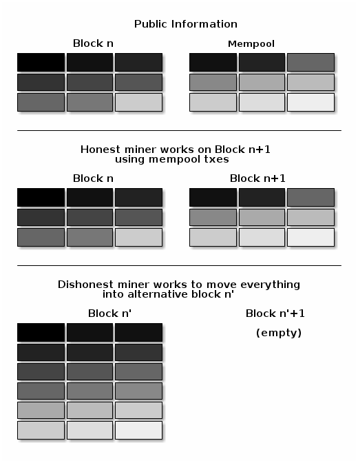

# 反费用狙击 - Anti Fee Sniping

**费用狙击**是指矿工故意重新挖掘一个或多个之前的区块，以取得最初创建这些区块的矿工所得的交易费。尽管重新挖掘前一个区块的成功概率低于简单地扩展链条添加一个新区块，但如果前一个区块中的交易费远高于矿工的交易池（mempool）中当前交易的交易费，那么这种做法可能更有利可图。

随着比特币（Bitcoin）补贴的持续减少，交易费开始主导比特币区块奖励，费用狙击成为一个可能出现的问题。如果交易费成为唯一关注点，那么一个拥有 `x` 百分比哈希率的矿工有 `x` 百分比的机会挖掘下一个区块，因此他们诚实挖矿的预期价值是他们交易池中[最佳费率集合交易](https://bitcoinops.org/en/newsletters/2021/06/02/#candidate-set-based-csb-block-template-construction)的 `x` 百分比。

或者，矿工可以选择不诚实地尝试重新挖掘前一个区块，并增加一个全新的区块以扩展链条。这种行为被称为费用狙击，如果其他矿工都诚实地挖掘，那么不诚实矿工成功的概率是 `(x/(1-x))^2`。尽管费用狙击的总体成功概率低于诚实挖矿，但如果前一个区块的交易支付的费率明显高于当前交易池中的交易，那么尝试不诚实挖矿可能是更有利可图的选择——小概率赢得大金额可能比大概率赢得小金额更值得。

问题实际上比上述描述的更糟，因为每一个选择不诚实挖矿的矿工都会减少试图扩展链条的诚实矿工的数量。诚实矿工控制的哈希率份额越小，不诚实矿工成功的可能性就越大，因此一个单独的大型矿工理性选择不诚实挖矿，可以引发越来越多的小型矿工也理性地转向不诚实挖矿。如果这种情况持续一段时间，确认分数（confirmation scores）就不再是交易最终确定的代表，比特币在问题解决之前变得无法使用。我们预计最有可能的解决方案将是挖矿的集中化——代表大多数哈希率的矿工卡特尔同意永远不重组彼此的区块，可以恢复系统的稳定性，但这增加了他们日后可能审查某些交易的风险。

## 缓解措施

* **区块交易限制（Block Transaction Limit）**：如果没有限制一个区块内可以包含的交易数量，如区块大小或区块重量限制，不诚实矿工可能会取走他们现在知道的所有交易，并尝试将它们放入他们正在重新挖掘的最旧的区块中。其他区块将是空的，矿工只是创建它们，以尽可能多的工作量证明（proof of work）来掩埋他们重新挖掘的区块。

<figure><figcaption></figcaption></figure>

限制比特币区块内可以包含的交易数量产生两个理想效果：

1. 它倾向于防止链条顶端的任何新区块包含所有待处理交易，为下一个区块留下一些交易。如果诚实挖掘下一个区块预期的交易费接近于不诚实重新挖掘前一个区块可获得的交易费，所有理性矿工都会诚实行事。
2. 它确保，即使不诚实矿工确实重新挖掘了区块，他们也无法通过让接近顶端的区块空着来实现最大收入——这些区块将需要包含付费交易。其他不诚实矿工可能会尝试自己费用狙击这些交易，减少最初费用狙击矿工的收入，并可能阻止他们进行费用狙击。

* **重排保护（反费用狙击，Rearrangement Protection (Anti Fee Sniping)）**：即使存在区块大小限制，不诚实的矿工在尝试重新挖掘的区块中并不需要使用完全相同的交易集。他们可以用自己交易池中更高费率的交易替换那个区块中的低费率交易。这样做的好处是，将高费率交易埋藏在链中更靠后的位置，这样其他不诚实的矿工如果想要第二次重新挖掘它们，就需要付出更多的努力。

<figure><figcaption></figcaption></figure>

可以通过防止矿工在重新挖掘任何之前区块的版本中包含待处理的高费率交易来限制这种滥用行为。矿工只被允许在当前链顶端之后的区块中包含待处理交易。换句话说，在理想情况下，由经济上理性的不诚实矿工创建的区块中的常规交易与诚实矿工创建的区块之间不应存在任何差异。这可以减少不诚实矿工可获得的收入，并使他们更容易受到其他不诚实矿工的费用狙击——再次降低初始不诚实矿工的预期回报，可能足以使他们首先选择诚实地挖掘。

这种重排保护通常称为**反费用狙击（Anti Fee Sniping）**。最初在比特币核心（Bitcoin Core）[实现](https://github.com/bitcoin/bitcoin/issues/2340)，现在也被其他几个钱包使用。

当今所有实现反费用狙击的钱包都使用 nLockTime 高度锁定来防止交易被包含在之前区块的重新挖掘版本中。也[有可能](https://lists.linuxfoundation.org/pipermail/bitcoin-dev/2021-June/019048.html)使用 [BIP68](https://github.com/bitcoin/bips/blob/master/bip-0068.mediawiki) nSequence 高度锁定来实现相同的保护，这可以帮助使常规钱包交易看起来像合约协议交易，反之亦然。

我们并不知道有任何开发人员认为上述机制是解决费用狙击问题的完整解决方案，但迄今为止提出的每一个其他缓解措施似乎都有显著的缺点。这些替代方案似乎都不是研究和开发的活跃领域。

## 主要代码和文档

* [比特币核心 #2340：使用 nLockTime 阻止费用狙击](https://github.com/bitcoin/bitcoin/pull/2340)
* [在Taproot交易中使用nSequence进行反费用狙击保护](https://lists.linuxfoundation.org/pipermail/bitcoin-dev/2021-June/019048.html)

## Optech 新闻简报和网站提及

**2022**

* [关于费用和费用狙击的讨论 CoreDev.tech 转录](https://bitcoinops.org/en/newsletters/2022/10/26/#fees)
* [关于费用狙击与区块补贴关系的讨论](https://bitcoinops.org/en/newsletters/2022/07/20/#fee-sniping)
* [BDK #611 开始默认使用反费用狙击](https://bitcoinops.org/en/newsletters/2022/07/06/#bdk-611)
* [LDK #1531 开始为LN资金交易使用反费用狙击](https://bitcoinops.org/en/newsletters/2022/06/29/#ldk-1531)
* [BIPs #1269 将BIP326分配给默认Taproot反费用狙击的建议](https://bitcoinops.org/en/newsletters/2022/03/16/#bips-1269)

**2021**

* [提议钱包在Taproot交易中默认设置nSequence的BIP](https://bitcoinops.org/en/newsletters/2021/06/16/#bip-proposed-for-wallets-to-set-nsequence-by-default-on-taproot-transactions)

**2020**

* [C-Lightning #3465 为提现交易实施反费用狙击](https://bitcoinops.org/en/newsletters/2020/02/12/#c-lightning-3465)
* [建议在交互式LN资金交易中使用反费用狙击](https://bitcoinops.org/en/newsletters/2020/02/05/#interactive-construction-of-ln-funding-transactions)

**2018**

* [LND #2063 更新清算器以使用 nLockTime 反费用狙击](https://bitcoinops.org/en/newsletters/2018/10/23/#lnd-1978)
